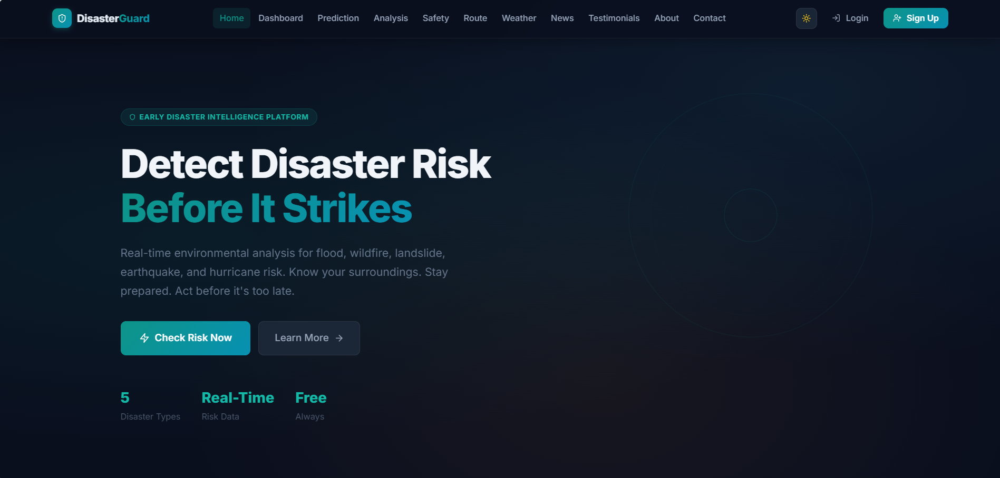
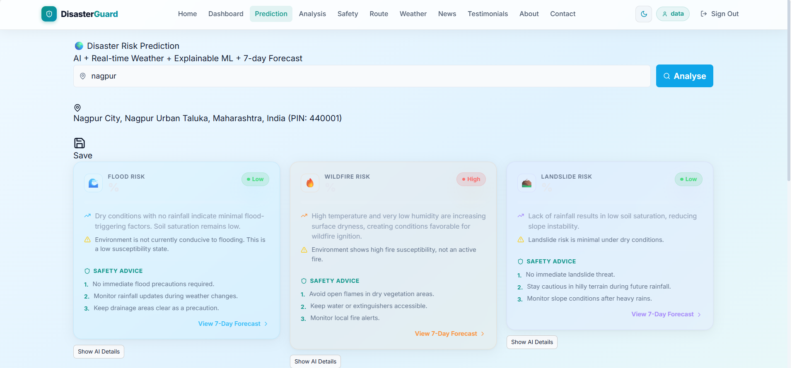
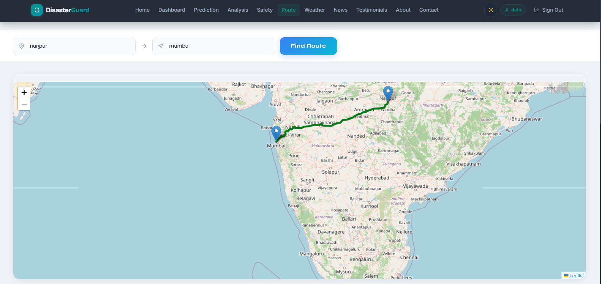

<p align="center">
  
</p>

# 🌍 DisasterGuard Platform

A full-stack disaster intelligence platform that predicts the risk of floods, earthquakes, cyclones, landslides, and wildfires using Machine Learning and real-time weather data.

> 🎓 Final Year B.Tech Major Project

---

## ✨ Features

- 🤖 Multi-disaster risk prediction
- 🌦️ Live weather monitoring
- 🗺️ Interactive maps
- 🛣️ Safe route navigation
- 📊 Risk analysis dashboard
- 📧 Safety alerts & recommendations

---

## 🛠️ Tech Stack

<p align="center">
  
</p>

**Frontend:** React, TypeScript, Vite, Tailwind CSS

**Backend:** Flask, Python

**Machine Learning:** Scikit-learn, XGBoost, Pandas, NumPy

**Database:** MongoDB Atlas

**Tools:** Git, GitHub, VS Code, Postman

---

# 📸 Screenshots & Demo


### Dashboard




### AI Risk Prediction




### Safe Route Planning



---

## ⚙️ Installation

### Clone the repository

```bash
git clone https://github.com/mansipotwar/DisasterGuard-Platform.git
cd DisasterGuard-Platform
```

### Backend

```bash
pip install -r requirements.txt
python run.py
```

### Frontend

```bash
cd frontend
npm install
npm run dev
```

### Environment Variables

Create a `.env` file using `.env.example` and add your own API keys.


## 🎥 Demo & Showcase

🔗 **Live Application:** https://disasterguard-frontend-git-main-maanasies-projects.vercel.app/

🎬 **Quick Demo (LinkedIn):** https://linkedin.com/your-post-link

📺 **Full Project Walkthrough:** https://youtube.com/your-video-link

## 📂 Project Structure

```text
DisasterGuard-Platform/
├── app/
├── frontend/
├── assets/
├── mock/
├── mocks/
├── postman/
├── .env.example
├── requirements.txt
└── run.py
```

## 📄 License

This project is licensed under the MIT License.

## 👩‍💻 Author

**Mansi Potwar**

- GitHub: https://github.com/mansipotwar
- LinkedIn: https://www.linkedin.com/in/YOUR-LINKEDIN
